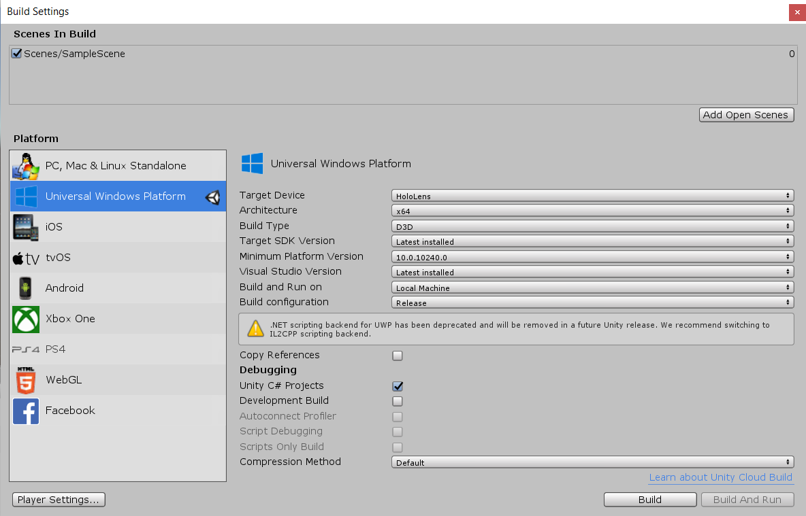

# HoloBounce
Project for learning how to work with Microsoft HoloLens, by making a simplistic MR videogame.
This readme serves as footnotes from this project. It covers some basic information about the system, HoloLens device and how to use and handle it as a beginner.

## Link to Microsoft HoloLens device configurations and other setup:
The device used for the project is HoloLens 1 by Microsoft. Aditional information about it should be viewed at the source: https://docs.microsoft.com/en-us/hololens/hololens1-hardware.
Before starting development, make sure you have the correct tools installed: https://docs.microsoft.com/en-us/windows/mixed-reality/develop/install-the-tools?tabs=unity.

We are using Unity 2018.4.10f1 for this project.

## Link to Microsoft HoloLens Origami tutorial:
In the link bellow, there's a tutorial by Microsoft which is a good "HelloWorld" project for HoloLens development.
https://docs.microsoft.com/en-us/windows/mixed-reality/develop/unity/tutorials/holograms-101e.

It is a good way for any newcommers to the project to get familiar with some of the basic functionalities that the development kit has to offer as well as how to apply them.

## Testing the project:
How to test the project on the HoloLens through Unity editor:
  0. Make sure Holographic Remoting Player is installed on the HoloLens first.
  1. On your HoloLens, run the Holographic Remoting Player, available from the Windows Store. Launch the application on the device, and it will enter a waiting state and show the IP address of the device. Note down the IP.
  2. In Unity editor: Open Window > XR > Holographic Emulation.
  3. Change Emulation Mode from None to Remote to Device.
  4. In Remote Machine, enter the IP address of your HoloLens noted earlier.
  5. Click Connect.
  6. Ensure the Connection Status changes to green Connected.
  7. You can now click Play in the Unity editor.
  
## Testing the project remotely (only in Editor):
The following is meant as an easier way of testing/simulating some of the features without the need of the HoloLens device.
However, new features should be tested on the device at some point before building and pushing to the device.

Use RoomScene, as the development scene. This scene should not be built onto the device.
Make sure that the PlayerKeyboardCOntroller script on the Player GameObject is set to active. It should not be active in the main scene (SampleScene).

The current commands for movement are the WASD keys. For camera rotation, use the mouse (note that there is a limit of turn).
The Left Mouse Button is currently set to simulate the AirTap gesture, but will probably require tweaks in future builds, based on implementation needs.
The 'R' Key is used to generate a new ball, such as when clicking the NewBall UI element (note that the UI must be placed in the room for this to work).

Any additional features that will be tested with the PlayerKeyboardController should be documented here as well.

## How to build the project and deploy it to device:
To build the project:
  1. In Unity editor: File > Build Settings.
  2. Switch platform to Universal Windows platform.
  
  3. Add Scenes.
  4. Target device should be HoloLens.
  5. Build configuration should be Release.
  6. Click Build.
  7. Make sure you're saving the build version in an empty folder.
  8. When it is build, open the .sln file with Visual Studio.
  9. Set Solution Configurations from Debug to Release and Solution Platforms from ARM to x86.
  10. Select Remote Machine and input the device IP adress.
  11. The application should now hopefully be on the device.

## How to use the game on the device:
To run the game:
  1. Use the bloom gesture to open the menu.
  2. Select all apps and find the game.
  3. Click on the icon, placing the application window into the space.
  4. The game will start within a minute.
To quit the game, just click the menu item QUIT.

## How to charge the device (based on our experience):
To charge:
  1. Plug it into an outlet (micro usb).
  2. Turn off the device.
  3. Check if the device is still turned off (after a minute or two).
  4. Charge for about 10h.

After charging:
  1. Wait a minute.
  2. Turn off the device.

Notes: DO NOT have the device on while charging, as the battery depletes faster than it charges.

## How to stream the game (livestream):
To stream the game, have the HoloLens paired with the computer, and have the Microsoft HoloLens application installed (you can download it from Microsoft Store https://www.microsoft.com/en-us/p/microsoft-hololens/9nblggh4qwnx?activetab=pivot:overviewtab).
Connect to device by inputing it's IP into the Microsoft HoloLens application.
You can stream the live feed from there.
